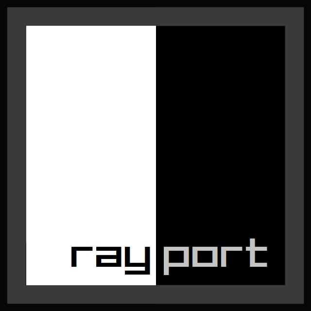

<div align="center">
      
    <p>Awesome C99, Header-Only, <a href="https://github.com/SasLuca/rayfork">rayfork</a> wrapper for <a href="https://github.com/raysan5/raylib">raylib</a>!</p>
</div><br>

rayport wraps raylib API depending on what rayfork supports from raylib to keep compatibiltiy, Also RLGL wrapped!
You need to include `raylib.h` and rayfork to use rayport!

### Why rayport?

- Port raylib games easily to iOS and Consoles via rayfork!
- Easy way to save porting time, You just need to rewrite window and input code (Depending on window and input library will used with rayfork).
- More independency to raylib code via rayfork (As rayfork can use any window and input library).
- rayport is written in C99, Making it portable and easy to use anywhere you name it!

### Example

Here is a simple example for rayport with rayfork uses GLFW (Include "rayport.h" with including rayfork and raylib previously!)

```c
#include "raylib.h"
#include "rayfork.h"
#include "glad.h"
#include "rayport.h"
#include "GLFW/glfw3.h"

int main()
{
    // Init glfw and opengl
    glfwInit();
    GLFWwindow* window = glfwCreateWindow(800, 450, "rayfork simple glfw example", NULL, NULL);
    glfwMakeContextCurrent(window);
    glfwSwapInterval(1);
    gladLoadGL();

    // Init rayfork
    rf_context rf_ctx = {0};
    rf_default_render_batch rf_mem = {0};
    rf_init(&rf_ctx, &rf_mem, 800, 450, RF_DEFAULT_OPENGL_PROCS);

    // Load a texture with the default libc allocator and io callbacks.
    Texture2D texture = LoadTexture("bananya.png");

    // Main game loop
    while (!glfwWindowShouldClose(window))
    {
        // Render the image and clear the background to some nice shade of white
        BeginDrawing();
        ClearBackground(RAYWHITE);
        DrawRectangle(0, 0, 100, 100, RED);
        DrawTexture(texture, 0, 0, WHITE);
        EndDrawing();

        glfwPollEvents();
        glfwSwapBuffers(window);
    }
}
```

Original code can be found [here](https://github.com/SasLuca/rayfork-tests/blob/master/special-setup-tests/simple-glfw/main.c).


### NOTES

1. Note that rayfork still miss some features unlike raylib, So some functions aren't wrapped yet!
2. Since 10/September/2020, You should include `easings.h` and `raymath.h` in order to use raymath and easings.
3. Although rayfork still miss some stuff, I successed lately in wrapping more stuff (And will still do)!
4. Don't use `rlgl.h` since RLGL wrapped from `rayport.h`, That's to keep compatibility!
5. If you want to use custom `raylib.h` (Your own one), Make sure you add `bool valid` to structs `Texture2D` and `Image` in `raylib.h`.
6. If you don't care about step 5, I made `raylib.h` ready for use with `rayport.h`, You just need to include rayfork.

> For list of available wrapped functions (As enums and colors wrapped), See [here](https://github.com/Rabios/rayport/blob/master/api.md).

> Also, See [changelog](https://github.com/Rabios/rayport/blob/master/changelog.md) for changes!

### Special Thanks

1. [Ramon Santamaria (raysan5)](https://github.com/raysan5), Who made [raylib](https://github.com/raysan5/raylib).
2. [Luca Sas (SasLuca)](https://github.com/SasLuca), Who made [rayfork](https://github.com/SasLuca/rayfork).
